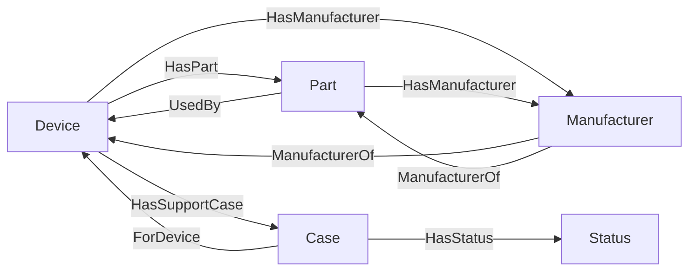

# Technical Support Sample Dataset

This repository contains a sample dataset designed for learning how to develop and deploy a [Curiosity Workspace](https://curiosity.ai/workspace) instance with custom data. The dataset includes fictional but realistic data on products, parts, and customer support cases generated using a large language model (LLM). This data can be used to experiment with Curiosity's knowledge graph, natural language processing and AI-powered features.

## Dataset Overview

The sample dataset consists of three primary datasets:

- **Devices**: A list of product names.
- **Parts**: A collection of parts associated with the products, including part names, manufacturer, and the products they belong to.
- **Support Cases**: Fictional AI-generated customer support cases related to the products and parts in the dataset, including a summary, conversation, applicable device, and resolution status.

The datasets have been generated to simulate realistic technical support data and offer a basis for testing and learning how to use the [Curiosity Library](https://www.nuget.org/packages/Curiosity.Library) to ingest and structure data on a Curiosity Workspace graph.

## File Structure

```
|-- data/
|   |-- devices.json            # Product data
|   |-- parts.json              # Part data
|   |-- support-cases.json      # Support case data
|-- README.md                   # This documentation
```

## Schema

The schema for the dataset is as follows:

```csharp
public class Device
{
    public string Name { get; set; }
}

public class Part
{
    public string Name { get; set; }
    public string Manufacturer { get; set; }
    public string[] Devices { get; set; }
}

public class SupportCase
{
    public string Summary { get; set; }
    public string Content { get; set; }
    public string Status { get; set; }
    public string Device { get; set; }
    public DateTimeOffset Time { get; set; }
}
```

A suggested base graph schema could be:



## Usage

1. **Set up your Curiosity Workspace**: Follow the [Curiosity Workspace documentation](https://dev.curiosity.ai) to get your environment ready.
2. **Write a data connector**: Write a sample [data connector](https://dev.curiosity.ai/data-sources/api-integrations) using the JSON files from the `data/` directory into your Curiosity Workspace.
3. **Explore the data**: Use Curiosity’s administrative interfaces to configure NLP parsing, linking, [search](https://dev.curiosity.ai/search/introduction) and custom views for products, parts, and support cases.
4. **Build and deploy insights**: Practice creating [custom user interfaces](https://dev.curiosity.ai/interfaces/introduction), implementing [custom API endpoints](https://dev.curiosity.ai/endpoints/introduction), and explore the graph using the shell within the workspace.

## License

This sample dataset is provided for educational and demonstration purposes only. It is not intended for any other use.

---

Happy exploring with Curiosity Workspace! 🚀

